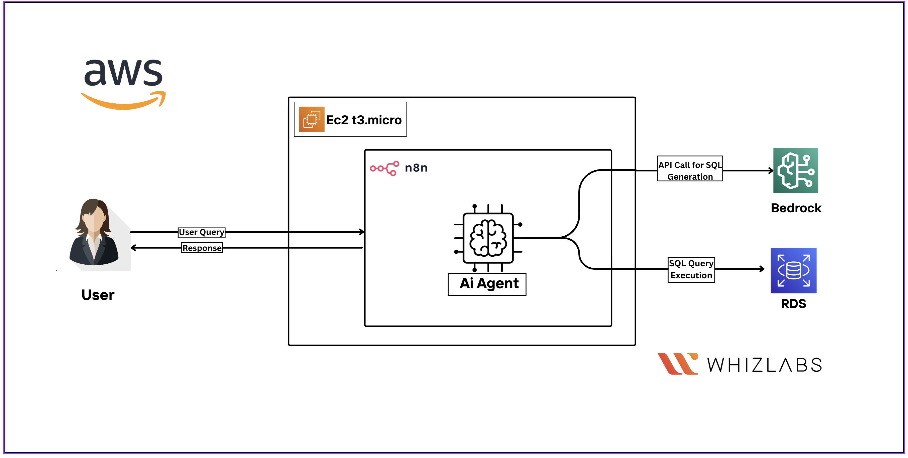

# Database Management Using an AI Agent with n8n and RDS

## Roles

- Cloud Developer
- Machine Learning Engineer
- AI Engineer

## Categories

- Compute
- Machine Learning

---

# Lab Details

1. In this lab, you will create a **serverless AI-powered database management agent** using **n8n hosted on an AWS EC2 instance**, integrated with **Amazon Bedrock using the Nova Lite model** and an **Amazon RDS PostgreSQL database**.

   The workflow uses n8n nodes to:

   - Trigger on chat messages
   - Process queries using Amazon Bedrock
   - Execute SQL queries on Amazon RDS
   - Maintain conversation memory
   - Provide a frontend chat interface for user interaction

2. **Duration:** 1 Hour

3. **AWS Region:** US East (N. Virginia) — `us-east-1`

   > Ensure that the Amazon Bedrock model is available in this region.

---

# Introduction

## Amazon Bedrock

**Amazon Bedrock** is a fully managed service that simplifies building and scaling generative AI applications using foundation models from leading providers.

It provides access to pre-trained models such as **Amazon Nova Lite** through APIs, eliminating the need to manage the underlying infrastructure.

This enables rapid integration of AI capabilities into applications such as the n8n workflow used in this lab for processing database queries.

---

## AWS RDS (PostgreSQL)

**Amazon RDS — Relational Database Service** provides managed PostgreSQL databases and handles:

- Setup
- Scaling
- Backups
- Maintenance

In this lab, Amazon RDS hosts the PostgreSQL database used by the AI agent to execute SQL queries generated through Amazon Bedrock.

---

## n8n

**n8n** is an open-source workflow automation tool that enables users to build complex workflows using a visual interface.

It supports integrations with AWS services and custom AI-agent nodes, making it suitable for orchestrating:

- Chat triggers
- AI processing
- Conversation memory
- Database operations

---

# Lab Feature

This lab focuses on building an **AI-powered database management agent** using:

- n8n
- Amazon Bedrock
- Amazon RDS
- Amazon EC2

You will:

1. Deploy an EC2 instance with n8n
2. Configure an Amazon RDS PostgreSQL database
3. Set up an n8n workflow
4. Process user queries through a chat interface
5. Use Amazon Bedrock Nova Lite for SQL generation
6. Maintain conversation context and memory

---

# Benefits

## Amazon Bedrock AI Integration

Learn how to use Amazon Bedrock's **Nova Lite** model to dynamically generate SQL queries based on user input.

## n8n Workflow Automation

Gain experience creating workflows with n8n nodes for:

- Chat triggers
- AI processing
- Memory buffering
- Database operations

## RDS PostgreSQL Management

Understand how to set up and connect to a managed PostgreSQL database for secure query execution.

## EC2 Deployment

Learn how to deploy n8n on an Amazon EC2 instance using Docker for workflow hosting.

---

# Architecture Diagram



---

# Task Details

1. Sign in to the AWS Management Console
2. Create and configure an Amazon RDS PostgreSQL database with a Security Group
3. Launch an Amazon EC2 instance
4. Deploy n8n using Docker
5. Configure the n8n workflow with nodes and connections
6. Validate the lab

---

# Launching the Lab Environment

## Step 1

Click the **Start Lab** button to launch the lab environment.

## Step 2

Wait for the cloud environment to be provisioned.

Provisioning usually takes less than a minute.

## Step 3

Once the lab starts, you will be provided with:

- IAM Username
- Password
- Access Key
- Secret Access Key

> **Note:** You can start only one lab at a time.
---

# Lab Steps

## Task 1: Sign in to AWS Management Console

1. Click the **Open Console** button. You will be redirected to the AWS Console in a new browser tab.

2. On the AWS sign-in page:

   - Leave the **Account ID** as default.
   - **Do not edit or remove the 12-digit Account ID** present in the AWS Console. Otherwise, you cannot proceed with the lab.
   - Copy the **User Name** and **Password** from the lab console.
   - Enter them into the **IAM Username** and **Password** fields in the AWS Console.
   - Click **Sign in**.

3. Once signed in to the AWS Management Console, set the default AWS Region to:

   **US East (N. Virginia) — `us-east-1`**

---

## Task 2: Create & Configure an RDS PostgreSQL Database with Security Group

### Step 1: Open EC2

1. In the AWS Console search bar, type **EC2**.
2. Select **EC2** from the results.

### Step 2: Create a Security Group

1. In the EC2 service portal, under **Network & Security**, click **Security Groups** in the left-hand panel.
2. Click **Create Security Group**.

Enter:

- **Security group name:** `RDS_sg`
- **Description:** `Creating RDS Security Group`
- **VPC:** Default VPC

### Step 3: Configure Inbound Rules

Under **Inbound rules**, click **Add Rule** and configure the following:

#### SSH

- **Type:** SSH
- **Port Range:** `22`
- **Source:** Anywhere (`0.0.0.0/0`)

#### PostgreSQL

- **Type:** PostgreSQL
- **Port Range:** `5432`
- **Source:** Anywhere (`0.0.0.0/0`)

#### Custom TCP

- **Type:** Custom TCP
- **Port Range:** `5678`
- **Source:** Anywhere (`0.0.0.0/0`)

> **Note:** Port `5678` is used by n8n, a workflow automation tool, to run its web interface.

3. Click **Create Security Group**.

---

### Step 4: Open Amazon RDS

1. In the AWS Console search bar, type **RDS**.
2. Select **Aurora and RDS** from the results.
3. Click **Databases** from the left navigation menu.
4. Click **Create database**.

---

### Step 5: Configure the PostgreSQL Database

In the **Create Database** section, specify the following:

- **Engine options:** PostgreSQL
- **Database creation method:** Full configuration
- **Engine Version:** Default
- **Template:** Free tier or sandbox
- **DB instance identifier:** `mydbinstance`
- **Master password:** `whizlabs123`
- **Confirm password:** `whizlabs123`

> **Note:** This username/password combination is used to log in to the database. Make note of it somewhere safe.

### DB Instance Class

- **Class:** Burstable classes (includes t classes)
- **Instance type:** `db.t3.micro`
- **Resources:** 2 vCPUs, 1 GiB RAM

### Storage

- **Storage type:** General Purpose SSD (`gp2`)
- **Allocated storage:** `20 GB`
- **Enable storage autoscaling:** Uncheck

### Connectivity

- **Virtual Private Cloud (VPC):** Default VPC
- **Subnet group:** Default
- **Public Access:** Yes
- **VPC Security groups:** Choose existing
- Remove the default security group.
- Select **`RDS_sg`** from the dropdown list.

### Additional Configuration

Expand **Additional Configuration** and configure:

- **Initial database name:** `myrdsdatabase`
- **DB parameter group:** Default
- **Option group:** Default
- **Enable automated backups:** Uncheck
- **Enable encryption:** Uncheck
- **Enable auto minor version upgrade:** Uncheck
- **Maintenance window:** No preference
- **Enable deletion protection:** Uncheck

Leave all other parameters as default.

Click **Create database**.

### Step 6: Wait for RDS

It may take around **5 minutes** for the database to become available.

Wait until the status changes from:

`Creating` → `Available`

### Step 7: Copy the RDS Endpoint

1. Open **mydbinstance**.
2. Go to **Connectivity & security**.
3. Note the **Endpoint**.

Example:

```text
mydbinstance.c81x4bxxayay.us-east-1.rds.amazonaws.com
```

---

## Task 3: Launch an EC2 Instance

1. Ensure you are in:

   **US East (N. Virginia) — `us-east-1`**

2. Navigate to **EC2** from the AWS Console.

3. Click **Instances** in the left panel.

4. Click **Launch Instances**.

### Instance Configuration

- **Name:** `Ec-n8n-Server`
- **AMI:** Amazon Linux 2023 AMI
- **Instance Type:** `t3.micro`

> **Note:** `t3.micro` provides 2 vCPUs and 1 GB memory and is suitable for lightweight applications, development environments, and low-traffic web servers.

### Create a Key Pair

Click **Create a new key pair**.

Configure:

- **Key pair name:** `WhizKey`
- **Key pair type:** RSA
- **Private key file format:** `.pem`

### Network Settings

Click **Edit** under **Network Settings**.

Configure:

- **Security group:** Select existing security group
- **Common security groups:** `RDS_sg`

Leave everything else as default.

Click **Launch Instance**.

---

## Task 4: Deploy n8n via Docker

### Step 1: Connect to EC2

1. Select the EC2 instance.
2. Click **Connect**.
3. Under **EC2 Instance Connect**, click **Connect**.

---

### Step 2: Update the EC2 Instance

Ensure the system package index and installed packages are up to date.

Run:

```bash
sudo su
sudo dnf update -y
```

---

### Step 3: Configure Swap Space

Because the `t3.micro` instance has limited memory, configure **2 GB of swap space** before installing and running n8n.

Run:

```bash
sudo dd if=/dev/zero of=/swapfile bs=1M count=2048
sudo chmod 600 /swapfile
sudo mkswap /swapfile
sudo swapon /swapfile
```

Verify the swap:

```bash
free -h
```

---

### Step 4: Install Docker

Install the Docker engine:

```bash
sudo dnf install docker -y
```

Start Docker:

```bash
sudo systemctl start docker
```

Enable Docker to start automatically during system boot:

```bash
sudo systemctl enable docker
```

Check Docker status:

```bash
sudo systemctl status docker
```

Look for:

```text
active (running)
```

Press **Ctrl+C** to exit the status view.

---

### Step 5: Download the n8n Docker Image

Run:

```bash
docker pull n8nio/n8n
```

---

### Step 6: Start the n8n Container

Run:

```bash
sudo docker run -d \
  --name n8n \
  -p 5678:5678 \
  -e N8N_PROTOCOL=http \
  -e N8N_HOST=localhost \
  -e N8N_PORT=5678 \
  -e N8N_SECURE_COOKIE=false \
  -v n8n_data:/home/node/.n8n \
  n8nio/n8n
```

---

### Step 7: Open n8n in Browser

Copy the EC2 n8n server's **Public IP address**.

Open:

```text
http://<EC2-n8n-server-public-ip>:5678
```

Replace `<EC2-n8n-server-public-ip>` with the actual public IP address of the EC2 instance.

You should see the n8n web page.

---

## Task 5: Configure n8n Workflow with Nodes and Connections

### Step 1: Create the n8n Account

Enter:

- Email
- First name
- Last name
- Password

Password requirements:

- At least 8 characters
- At least 1 number
- At least 1 capital letter

Click **Next**.

Then:

1. Click **Get Started**.
2. On the **Get paid features for free (forever)** prompt, click **Skip**.
3. Click **Start from Scratch**.

---

### Step 2: Add Chat Trigger

1. Click the **+** icon on the right side.
2. Search for **Chat Trigger**.
3. Select **Chat Trigger**.
4. Press **Esc**.

---

### Step 3: Add AI Agent

1. Click the **+** icon.
2. Search for **AI Agent**.
3. Select it.

---

### Step 4: Configure the System Message

Inside the **AI Agent** node:

1. Click **Add Option**.
2. Choose **System Message**.
3. Delete the default message.
4. Paste the following:

```text
You are a database assistant. Your job is to convert user questions and requests into correct SQL queries for PostgreSQL. Generate precise SQL statements based on what the user asks for, whether it's retrieving data, creating tables, inserting records, or any other database operation.
```

5. Click **Back to Canvas**.

---

### Step 5: Add Amazon Bedrock Chat Model

Within the AI Agent node:

1. Locate the **+** icon beside **Chat Model**.
2. Click it.
3. Search for **AWS Bedrock**.
4. Select it.

---

### Step 6: Configure AWS Bedrock Credentials

1. Click the **Credential to connect with** field.
2. Select **Create new Credential**.
3. Copy the **Access Key** and **Secret Key** from the Whizlabs portal.
4. Paste them into the credential fields.
5. Click **Save**.

---

### Step 7: Select Amazon Nova Lite

In the **Model** section, select:

**Amazon Nova Lite**

Press **Esc** or click **Back to Canvas**.

---

### Step 8: Add PostgreSQL Tool

Within the **AI Agent Tool** section:

1. Click the **+** icon.
2. Add the **Postgres Tool**.

---

### Step 9: Configure PostgreSQL Credentials

1. In **Credentials to connect**, click **Create New Credentials**.
2. Replace the **Host** with the RDS endpoint from the previously created RDS database.
3. Enter the password:

```text
whizlabs123
```

4. Enable:

**Ignore SSL Issues (Insecure)**

5. Click **Save**.

---

### Step 10: Configure PostgreSQL Query

In the Postgres Tool:

- **Operation:** Execute Query

In the **Query** section, enter:

```text
{{ $fromAI('sql_statement') }}
```

Press **Esc**.

---

### Step 11: Open Chat

Click **Open chat**.

Run:

```text
Create a new database named EmployeeDB.
```

Then run:

```text
List all Available Databases
```

> **Note:** If you encounter any error, remove or replace the AI Agent or System Message as indicated by the lab instructions.

---

## Do You Know?

n8n is an open-source tool for automating workflows, connecting apps and APIs with a visual interface and custom JavaScript.

It offers:

- 600+ templates
- Self-hosting
- Cost-effective automation
- Scalable workflows
- AI agent development
- App and API integrations

It is useful for technical teams building AI agents or syncing data without managing complex infrastructure.

---

## Task 6: Validation of the Lab

Once the lab steps are completed:

1. Click the **Validation** button on the left-side panel.
2. The lab will validate the resources in your AWS account.
3. The result will show whether the lab was completed successfully.

---

# Completion & Conclusion

You have successfully:

- Created an Amazon RDS PostgreSQL database.
- Launched an EC2 instance.
- Deployed n8n using Docker.
- Configured an n8n workflow using:
  - Chat Trigger
  - AI Agent
  - PostgreSQL Tool
  - Amazon Bedrock
  - Amazon Nova Lite
- Executed SQL queries using the n8n chat interface.
- Created a database and tables.
- Inserted sample data using the AI-powered workflow.

---

# End Lab

1. Sign out of the AWS Account.
2. Click **End Lab** from the Whizlabs lab console.
3. Wait until the lab termination process completes.

You have successfully completed the lab.
